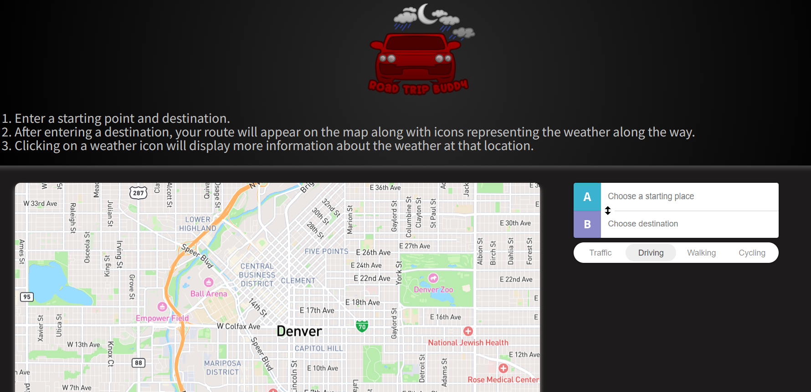

# Road Trip Buddy

## Description

Our app allows users to view a map for their road trip, with weather results for cities provided along their route. Instead of mapping out their journey and then performing separate browser searches for weather information per each location, users can now simply set their destination in Road Buddy and view the weather they will be encountering along their trip, all in one convenient place.

## Installation

NA

## Usage

To use Road Trip Buddy, open your browser to https://dsstad.github.io/travel-weather. Begin by entering your trip's starting and ending locations in input fields A and B to the right of the map. To change your desired mode of transportation, select between <i>Traffic</i>, <i>Driving</i>, <i>Walking</i>, or <i>Cycling</i> in the list above the input fields. You will see your route appear on the map. Click the various weather icons along your route to view extended weather details in each location. To switch between the app's dark and light modes, simply use the toggle button at the top right of the page.

## Screenshot

## Contributors

- Derick Stadler (github.com/DSStad)
- John Gordos (github.com/ThePebble01)
- Jordan Olguin (github.com/jordanolguin)
- Marlena Moore (github.com/Ms-Marlena)
- Madeline Moore (github.com/MsJamesM)

## Contributing

Pull requests are welcome. For major changes, please open an issue first
to discuss what you would like to change. Please make sure to update tests as appropriate.

## Credits

https://openweathermap.org

https://mapbox.com

https://getbootstrap.com

## License

NA
